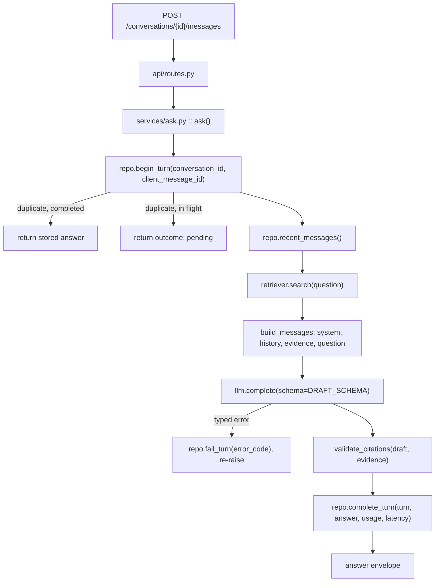

# S1 — the thinnest end-to-end slice

**Goal.** `POST /conversations/{id}/messages` with `{content, client_message_id}`
returns the typed answer envelope — `outcome`, `answer`, `citations[]`, `meta` —
having travelled the real pipeline in `app/services/ask.py`. No database, no
network, no OpenAI. The four Protocols exist; only fakes implement them.

**Why this shape.** The point of S1 is not the answer, it is the *contract*: the
envelope the web client will consume, the four seams the rest of the work slots
into, and a pipeline file that reads top to bottom. Everything real (pgvector,
claims.db, the resilient decorator) replaces a fake behind a Protocol without
touching `ask.py`.

**Decisions taken before writing this** (confirmed):

- Python **3.12** in a local `.venv`, per `00-architecture.mdc`. Only 3.14.4 is
  installed on this machine, so 3.12 gets installed first — but `pyproject.toml`
  declares `requires-python = ">=3.12"` with no upper pin, so an evaluator on
  3.14 does not hit a wall in the README. Docker fixes the exact version in S9.
- Deterministic guards in S1: **citation validation only**. `app/safety/redact.py`
  and prompt hashing are deferred to S2.

---

## The pipeline after S1



Steps that are *deliberately absent* and the session that brings them: the
tool-planning model call (arrives with `tools/claims.py`), `redact()` (S2), the
resilient decorator around `llm` (S2 — in S1 `ask` holds the raw provider, and
the swap is a one-line change at the composition root), the cost ledger
(`budget.py`, S2).

---

## The wire format, frozen here

Two types, each precise, no overlap:

- `Outcome = Literal["answered", "refused", "needs_clarification"]` — what the
  pipeline can produce. Lives on `Answer`.
- `TurnStatus = Literal["pending", "answered", "refused", "needs_clarification", "failed"]`
  — what a persisted turn can be. Lives on `Turn`, and it is the type of the
  envelope's `outcome` field, because the envelope is a *view of a turn*.

Which surface emits which, stated now so S7 is not a discovery:

- **POST** returns `answered | refused | needs_clarification` on the normal path,
  and `pending` in exactly one case (a duplicate `client_message_id` whose turn
  is still in flight). A failure is an **HTTP problem+json**, never a `failed`
  envelope — but the turn is still persisted as `failed` with its `error_code`.
- **GET /conversations/{id}/messages** (S7) renders history and must therefore
  represent all five, including `failed` with its `error_code` and `pending` for
  a turn still running. That is why `failed` is in the enum from day one even
  though no S1 response body carries it.

### Idempotency — the in-flight case decided now

`begin_turn(conversation_id, client_message_id)` returns one of three things,
and the branch is picked in `ask.py`:

1. **New** — a fresh `pending` turn; the pipeline runs.
2. **Duplicate, terminal** — replay the stored answer verbatim, same
   `message_id`, provider not called.
3. **Duplicate, still `pending`** — return the pending envelope
   (`outcome: "pending"`, `answer: null`, `citations: []`), provider not called.
   **Not a 409.** A double-click on Send, or the Retry button firing while the
   first request is still open, should see the turn it already created, not an
   error it has to interpret.

Today that is a dict lookup. In S7 it is `UNIQUE (conversation_id,
client_message_id)` and an `INSERT ... ON CONFLICT DO NOTHING` followed by a
read — the same three branches, which is the entire reason for choosing now.

## The four Protocols

Defined now, in their files, each with the smallest signature that already has
two implementations or a named change to absorb. **No speculative parameters** —
notably `LLMProvider.complete` gets no `tools` argument until a Tool exists,
because an unused parameter is exactly the excessive abstraction the rule
penalises.

- `app/llm/base.py` — `LLMProvider.complete(messages, *, schema, timeout_s=None) -> Completion`.
  Plus the value types the seam carries: `Message`, `Completion` (`text`,
  `parsed`, `usage`, `model`), `Usage` (`prompt_tokens`, `cached_prompt_tokens`,
  `completion_tokens`). `cached_prompt_tokens` exists from day one because the
  stable-prefix-first ordering is only defensible if it is measured.
- `app/retrieval/base.py` — `Retriever.search(query, *, product=None, k=5) -> list[Evidence]`.
  `product` is in the signature now: product filtering is a hard invariant, not
  a later feature.
- `app/tools/base.py` — `Tool` with `name`, `parameters` (JSON schema) and
  `run(params) -> Evidence`. **No implementation in S1.** It is written now so
  that `Evidence` is provably the one currency both a corpus chunk and a
  database row are expressed in.
- `app/storage/base.py` — `ConversationRepository` with `recent_messages`,
  `begin_turn`, `complete_turn`, `fail_turn`. `fail_turn` exists because a
  failed turn has to survive into history for GET to render it.

### `timeout_s` belongs to the decorator, not the pipeline

`timeout_s` is on the Protocol and **only `resilient.py` ever passes it.** The
decorator owns the request budget: it computes what remains and hands a deadline
down per call. If `ask.py` is ever seen passing `timeout_s`, budget policy has
leaked into the pipeline and the seam has become cosmetic. In S1 nothing passes
it and it defaults to `None`.

This is not in tension with omitting `tools`: `timeout_s` has a named consumer
arriving in S2 and a defined meaning today, whereas `tools` would have neither.
A one-line statement of the same rule goes into `.cursor/rules/10-llm.mdc`.

## Files

| File | What it is |
|---|---|
| `pyproject.toml` | `requires-python = ">=3.12"`; fastapi, uvicorn, pydantic; dev extra: pytest, pytest-asyncio, pytest-socket, httpx |
| `.gitignore` | `.venv/`, `__pycache__/`, `.pytest_cache/`, `.env` |
| `.env.example` | `LLM_PROVIDER`, `OPENAI_API_KEY`, `CHAOS_TIMEOUT_RATE`, `CHAOS_500_RATE`, `CHAOS_LATENCY_MS` — committed now, not as an S9 afterthought |
| `app/main.py` | composition root: `build_provider(os.getenv("LLM_PROVIDER", "fake"))`, `InMemoryRetriever`, `InMemoryConversationRepository`, hung on `app.state`; trace-id middleware and error handlers installed. No DI container |
| `app/api/routes.py` | one endpoint. Parses, calls `ask()`, shapes the envelope. Zero business logic |
| `app/api/schemas.py` | `MessageRequest`, `AnswerEnvelope`, `CitationOut`, `MetaOut` |
| `app/api/errors.py` | RFC 9457 `problem+json` handlers + `X-Trace-Id` middleware |
| `app/domain/models.py` | `Outcome`, `TurnStatus`, `Evidence`, `Citation`, `Answer`, `Turn` |
| `app/domain/errors.py` | `InsurCoError` base carrying a stable `code`; `ProviderTimeout`, `ProviderUnavailable`, `RateLimited`, `InvalidRequest`. The `code` is both the problem+json discriminator and the stored `error_code` |
| `app/llm/base.py` | `LLMProvider` Protocol + `Message`, `Completion`, `Usage` |
| `app/llm/fake.py` | scriptable double: a queue of `Completion`s or exceptions; empty queue falls back to a canned grounded answer citing the evidence it was handed |
| `app/llm/prompts/system.md` | the system prompt as a file, loaded by a five-line reader. Hashing is S2, but the prompt is never a string literal |
| `app/retrieval/base.py` | `Retriever` Protocol |
| `app/retrieval/memory.py` | `InMemoryRetriever` — two fixed chunks, replaced by `hybrid.py` |
| `app/tools/base.py` | `Tool` Protocol only |
| `app/storage/base.py` | `ConversationRepository` Protocol |
| `app/storage/memory.py` | dict-backed repo, three-branch `begin_turn`, replaced by `sql.py` |
| `app/services/ask.py` | the pipeline + `validate_citations` (public, so tests import it without reaching into a private) |
| `tests/` | seven tests, below |
| `docs/requirements.yaml` | the register, R-01…R-07, four `active` in S1 |
| `DECISIONS.md` | started here, with the `model`-in-meta entry |

`memory.py` in `retrieval/` and `storage/` are the only additions to the layout
in the rule; both are throwaway implementations that `hybrid.py` and `sql.py`
delete.

## The provider switch, wired now

`build_provider(name)` in `main.py` is a ten-line `if/elif` — not a plugin
system — covering all three declared modes:

- `fake` (default) — works today, no key, no network.
- `chaos` — raises a clear startup error naming the session that lands it (S6).
- `openai` — same, naming S5.

The point is that the switch, the env var and `.env.example` exist from the
first commit, so the *evaluator-with-no-API-key* path is the default path rather
than a thing remembered late. An unknown value is a startup failure, never a
silent fallback.

## The two fixed chunks

Real content from the real corpus, so the slice already answers golden case
gs-001 end to end and the version fields carry meaning rather than placeholders:

- `cg-auto-2024#2.1` — CG-AUTO-2024 §2.1 Vigência, "12 meses", product `Auto`,
  version 1.0, `superseded=False`.
- `ni-014-v2#3` — NI-014 v2.0 §3, prazo de aviso "3 dias úteis", product `All`,
  effective 2025-06-01, `superseded=False`.

Both are the same product line (`Auto` / `All`), so the happy path is
unambiguous. `needs_clarification` is made reachable by a **scripted fake
completion fixture** that emits it, exercised by T-13 — the third outcome is
live in the wire format on day one rather than dead until S8. The
*deterministic* product-span detector still lands with real retrieval, where it
has more than two chunks to reason over.

## The envelope

```json
{
  "conversation_id": "c-1",
  "message_id": "m-1",
  "outcome": "answered",
  "answer": "A vigência padrão é de 12 meses.",
  "citations": [
    {
      "evidence_id": "cg-auto-2024#2.1",
      "document_code": "CG-AUTO-2024",
      "document_title": "Condições Gerais do Seguro Auto",
      "section": "2.1 Vigência",
      "version": "1.0",
      "effective_date": "2024-01-01",
      "snippet": "..."
    }
  ],
  "meta": {
    "trace_id": "...",
    "provider": "fake",
    "model": "fake-1",
    "latency_ms": 3,
    "cost_usd": 0.0,
    "usage": { "prompt_tokens": 0, "cached_prompt_tokens": 0, "completion_tokens": 0 },
    "degraded": false
  }
}
```

`degraded` is present and always `false` in S1 so the web client's banner has a
field to bind to when ladder rung 2 arrives.

### `model` in success meta but never in errors — decided, not accidental

T-10 forbids the model name in error payloads while every success envelope
carries it. That asymmetry is deliberate and goes in `DECISIONS.md` in this
session rather than being noticed by someone else later:

An error payload is the artefact that travels — it gets forwarded, pasted into a
ticket and screenshotted, and provider error strings are the specific place
where prompt fragments and version detail leak. The success envelope is
telemetry for an authenticated internal tool's debug panel, where knowing which
model and which provider produced an answer is exactly what an analyst
disputing an answer needs. The ban is on the uncontrolled channel, not on the
identifier.

## Behaviour S1 must actually exhibit

1. **Happy path** — envelope with `outcome=answered` and citations that resolve
   to retrieved evidence.
2. **Third outcome live** — a scripted fake emits `needs_clarification` and it
   round-trips the envelope intact.
3. **Invented citation forces a refusal** — the fake scripts a citation to an
   `evidence_id` that was never retrieved; `validate_citations` returns
   `outcome=refused` with empty citations. The model is not asked to police
   itself.
4. **Idempotent replay** — the same `client_message_id` on a completed turn
   returns the same `message_id` and answer, provider called once.
5. **In-flight duplicate** — the same `client_message_id` while the first call
   is still running returns `outcome=pending`, provider called once.
6. **Errors leak nothing** — provider failure produces `problem+json` with a
   `trace_id` and no model name, prompt fragment or traceback; the turn is
   persisted `failed` with its `error_code`.
7. **The SDK is fenced** — `openai` is importable from nowhere but
   `app/llm/openai_provider.py`.

## Tests

Run under `pytest --disable-socket -q`. Every docstring names its requirement
and test ID from `docs/requirements.yaml`. IDs already fixed by
`30-tests.mdc` (T-03…T-10, T-16…T-18) are respected; S1 uses the free ones.

- `tests/test_ask_pipeline.py`
  - **T-01 / R-01** happy path: `answered`, citations resolve to retrieved evidence.
  - **T-13 / R-01** scripted `needs_clarification` round-trips.
  - **T-03 / R-02** invented citation ID → forced refusal, citations empty.
- `tests/test_api_messages.py`
  - **T-02 / R-01** envelope shape; duplicate `client_message_id` on a completed
    turn replays, provider called once.
  - **T-14 / R-01** duplicate while in flight → `outcome=pending`, provider
    called once. No sleeping: the fake holds an `asyncio.Event`, two `ask()`
    coroutines are gathered, the second is asserted, then the event is set.
  - **T-10 / R-06** provider failure → `problem+json` with `trace_id`, no model
    name / prompt / traceback; turn stored `failed` with `error_code`.
- `tests/test_import_boundaries.py`
  - **T-11 / R-07** AST-walk every file under `app/`; `import openai` and
    `from openai import` appear only in `app/llm/openai_provider.py`.

**Why T-11 now.** S1 is the only moment when the guard is free to write and
green by construction, and S5 — when the real adapter lands and the temptation
to reach for the SDK "just here" is highest — is exactly when it gets violated.
**T-12 is reserved** for the same trick in the tools session: a grep guard
asserting no `status = 'Pago'` literal appears in `app/tools/`, since that
undercounts paid claims by 13.9%.

### `docs/requirements.yaml`

Registers R-01…R-07 with `status: active | planned`, so IDs stop drifting and
the future `scripts/traceability.py` checks only the active ones:

- **R-01** every answer cites its sources — *active*
- **R-02** no answer in the sources → refusal — *active*
- **R-03** policyholder PII never in an answer — *planned, S2*
- **R-04** ≤ US$0.05 and p95 < 8 s — *planned, S2*
- **R-05** bounded, cost-aware retry and degradation — *planned, S2*
- **R-06** client errors leak no internals — *active*
- **R-07** provider isolation — *active*

## Order of work — two windows, one session

Realistically two-plus hours with a Python install in it, and context
accumulates the whole way. **Commit and clear after step 5.**

**Window 1 — the core**

1. Install Python 3.12 (`winget install Python.Python.3.12`; fall back to the
   python.org installer), create `.venv`, write `pyproject.toml`, `.gitignore`,
   `.env.example`, install deps.
2. `app/domain/` — the vocabulary everything else imports.
3. The four `base.py` Protocols; the `timeout_s` line into `10-llm.mdc`.
4. `fake.py` (including the `needs_clarification` and in-flight fixtures),
   `retrieval/memory.py`, `storage/memory.py`.
5. `app/services/ask.py` + `app/llm/prompts/system.md`. Green on the three
   pipeline tests.
   → `feat(services): R-01 grounded ask pipeline with citation validation`
   → **commit, clear context**

**Window 2 — the edge**

6. `app/api/` + `app/main.py` + the provider switch.
7. `docs/requirements.yaml`, `DECISIONS.md`, the four remaining tests.
8. `pytest --disable-socket -q` green, then one `curl` against `uvicorn`
   proving the envelope by hand.
   → `feat(api): R-06 message endpoint with problem+json errors`

## Out of scope for S1 — stated so it is not mistaken for an omission

Ingestion, pgvector, hybrid retrieval, `claims.db` and the claims tool, the
resilient decorator, the circuit breaker, the cost ledger, PII redaction, prompt
hashing, `GET /conversations/{id}/messages`, the React client, Docker, and the
real OpenAI provider.
