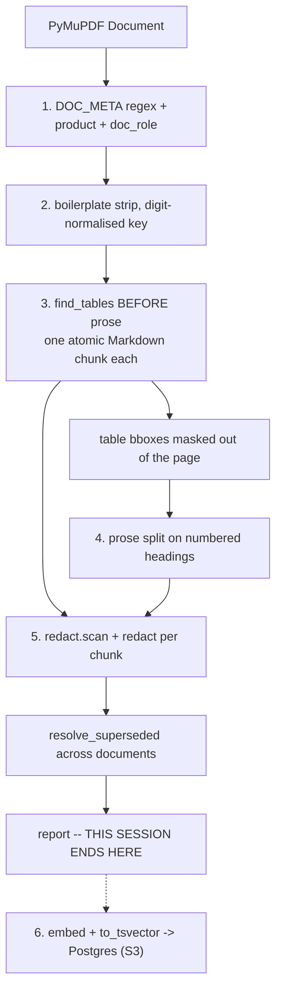

# S2 — ingestion: the corpus becomes an index

**Goal.** `python -m app.retrieval.ingest data/corpus --dry-run` reads the 13
real PDFs and prints a report that a reviewer can check against the corpus by
hand: chunks per document, tables found, footnotes attached, PII chunks flagged,
and the metadata row for each document. Steps 1–5 of the ingest order in
`15-retrieval.mdc`, implemented as pure functions. No database, no network, no
API key, no cost.

**Why this shape.** Step 6 (`embed` + `to_tsvector`) needs Docker, a migration,
a pgvector extension and a paid API call. Steps 1–5 need none of that — their
only IO is reading a PDF. That is a natural session boundary, not an arbitrary
one: everything in this session is verifiable offline against the real corpus
under `pytest --disable-socket`, and the report is the artefact that proves it.
Bundling Postgres in here would mean debugging a connection string on the same
afternoon as a table-detection heuristic, with a context window holding both.

**The renumbering, stated rather than left to drift.** S1 promised
`app/safety/redact.py`, the resilient decorator and the cost ledger in S2. This
session takes `redact.py` — ingest is its first consumer, one session earlier
than expected, which is the right order because PII enters at ingest. The
resilient decorator and `budget.py` (R-04, R-05) move to **S4**;
`docs/requirements.yaml` is corrected in this session rather than left claiming
S2.

**Decisions taken before writing this** (confirmed against the real PDFs, not
the pre-extracted text):

- The table-caption regex **requires the dash**: `^Tabela\s+\d+\s*[-–—]\s+\S`.
  See below — the loose form fails the build on a correct extraction.
- **Exact vector search, no ANN index.** Decided now so the migration in S3 is
  not written twice.
- `--no-embed` will store **`NULL`**, never a zero vector. Decided now for the
  same reason.

---

## What the corpus actually is

Every line here was checked against `data/corpus/*.pdf`. None of it is inferred
from the brief.

| Fact | Consequence for the code |
|---|---|
| The `DOC_META` header matches **13/13** | Step 1 needs no model call and no fallback |
| The title is always the line directly above the `DOC_META` line, once boilerplate is stripped | `document_title` is deterministic; no heuristic |
| **13 tables**, and `find_tables()` with default `lines_strict` finds exactly 13 | The acceptance gate is an equality, not a threshold |
| Two tables each in `MAN-SIN-2025` and `COM-REAJ-2025`; none in `GLOS-2024` or `POL-LGPD-2024`; one each in the other nine | Per-document expectations in the report, so a regression names its document |
| `^Tabela\s+\d+` matches **15** lines — two are prose line-wraps | The regex must anchor on the dash. See the box below |
| Only `NI-022` has footnotes, and only marker **(3)** appears in a cell | Exactly one footnote is attached corpus-wide; (1) and (2) stay in prose |
| The heading regex matches **204** lines, no false positives, and catches `2.2.1.2 Vistoria prévia` | Step 4 needs no length filter or lookahead |
| `Página 3 de 15` is unique per page | Frequency counting runs on a digit-normalised key, or ~15% of the boilerplate survives |
| `NI-014` v1's own history table calls its 1.0 `Vigente na data desta publicação` | Per-document status parsing alone leaves v1 unsuperseded. Supersession must be resolved across documents |
| `ATA-COM-2025-04` Tabela 1 holds five names, CPFs and phones — inside a table | The PII chunk is a table chunk, so redaction must handle cells, not just prose |
| That table's header is the **only one of thirteen** matching `Segurado\|Nome\|CPF\|Telefone\|E-?mail` | The column-blanking rule cannot quietly eat a `Cobertura` column |

### The caption regex was the dangerous bug, not an off-by-one

The fallback ladder for table detection is: default strategy; if a page has a
caption but yielded no table, retry that page with `strategy="text"`; if a
caption still has no table, **fail loudly and name it**. That is the right
ladder. But with the loose regex `^Tabela\s+\d+`, these two prose lines count as
captions:

```
MAN-SIN p11   Tabela 1. Confirmada a cobertura e cumpridas as exigências, procede-se à
NI-022  p2    Tabela 1 para Danos Elétricos.
```

Both pages then have "a caption and no table", so the ladder fires on prose and
**fails the build on a completely correct extraction** — and the failure message
points at PyMuPDF. That is an hour of debugging a library over one regex.

With the dash anchored the gate is 13, `lines_strict` returns 13, and the ladder
never fires. It stays in the code regardless: it costs four lines, and it is the
difference between a silent miss and a named failure the day a document arrives
drawn without ruling lines.

---

## The pipeline



Order matters in one direction only: **tables are extracted before prose, and
their bounding boxes are then masked out of the page**, so no cell is ever
emitted twice and no table is ever flattened into orphan text.

### Step 3 — the part that must not be approximate

Each `Table` from `page.find_tables()` becomes exactly one chunk:

- **Body** as Markdown from `table.extract()`, using `table.header.names` for
  the header row, and emitting the header as a data row too when
  `table.header.external` is false so no row is lost.
- **Caption**: nearest line above `table.bbox` within ~40pt matching the
  dash-anchored regex. Prepended to the chunk text and kept as a field.
- **Footnotes**: collect `^\((\d+)\)\s+.+` below the table, folding continuation
  lines until the next marker; attach **only** those whose `(n)` marker is found
  by scanning `\((\d+)\)` across the extracted cells; append as `> (3) ...`.

The canonical case is the reason for all of it: `Danos Elétricos (3) · R$ 250,00`
is a *wrong answer* without note (3), which waives the deductible entirely for
lightning damage evidenced by a technical report.

### Step 4

Split on `^\d+(\.\d+)*\s+[A-ZÀ-Ú]`. Heading path kept in `section` so a citation
can name it. Cap ~1200 chars, overlap **inside** a heading only, never across a
boundary. Page range recorded per chunk.

### Step 5 — one deliberate step beyond the rule

The rule names CPF / phone / e-mail. In `ATA-COM-2025-04` redacting only those
leaves `Marta Ferreira Bittencourt` sitting next to `SIN-2025-004512` in the
index — identifying, and matching the claims database row for row. So a
PII-flagged **table** chunk additionally gets any column whose header matches
`Segurado|Nome|CPF|Telefone|E-?mail` blanked. Deterministic, header-driven, no
model involved. All thirteen table headers were checked: exactly one matches.

CPF detection validates the check digits, so `R$ 100.000,00` is never a false
positive.

---

## Files

| File | What it is |
|---|---|
| `app/retrieval/ingest.py` | the session. Pure core: `parse_metadata`, `boilerplate_lines`, `extract_tables`, `split_prose`, `build_document(path) -> DocumentIngest`, `resolve_superseded(docs)`. Plus `report()` and a `main()` that today supports only `--dry-run` |
| `app/safety/redact.py` | `scan(text) -> set[PiiKind]`, `redact(text) -> str`, `redact_table_columns(headers, rows)`. Shared: the output scrubber imports this same module in S4 |
| `pyproject.toml` | add `pymupdf`. Nothing else — no dependency lands before the session that uses it |
| `tests/test_ingest.py` | T-15, parametrised over the acceptance assertions below |
| `docs/requirements.yaml` | new **R-08**; R-04 / R-05 corrected from S2 to S4 |
| `DECISIONS.md` | the caption-regex, exact-search and `Segurado`-column entries |

A local pydantic `Chunk` model in `ingest.py` describes the row shape.
`Evidence` in `app/domain/models.py` is **left alone** — it is the reader's
contract, and it grows `doc_role` / `contains_pii` when `hybrid.py` needs them.
Writing the columns into `Evidence` now would put storage concerns in the
domain type a week before anything reads them.

---

## The report

```
CODE             VER  EFFECTIVE   PRODUCT      ROLE       SUPERSEDED  PAGES CHUNKS TABLES NOTES PII
CG-AUTO-2024     3.2  2024-01-01  Auto         normative  no          15    N      1      0     0
NI-014           1.0  2023-01-01  All          normative  YES         2     N      1      0     0
NI-014           2.0  2025-06-01  All          normative  no          2     N      1      0     0
NI-022           1.3  2024-09-01  All          normative  no          2     N      1      1     0
ATA-COM-2025-04  final 2025-04-15 All          minutes    no          2     N      1      0     1
...
totals: 13 documents · N chunks · 13 tables · 1 footnote attached · 1 PII chunk
```

`YES` on `NI-014` 1.0 prints its reason — `superada @ NI-014 v2.0 Histórico` —
because a superseded flag with no provenance is the kind of thing nobody
re-checks.

### Acceptance assertions

Each is also a case in T-15. Fixed before the first run.

1. 13 documents parsed, **13 tables**, and **the fallback ladder never fired**.
2. Note (3) attached to `NI-022` Tabela 1; notes (1) and (2) **not** attached.
3. `ATA-COM-2025-04` Tabela 1 flagged `contains_pii`, with no CPF, no phone and
   no `Segurado` value surviving in the indexed text.
4. `NI-014` 1.0 superseded, 2.0 not.
5. No chunk contains a stripped boilerplate line.
6. **gs-004** — the `CG-AUTO-2024` coverage chunk contains both `100.000` and
   `150.000`. The graded criterion is "must not confuse RCF-DM with RCF-DC", and
   it is only satisfiable if both rows are in one chunk. This is the assertion
   that proves the atomic-table rule did its job.
7. **gs-009** — the `CG-AUTO-2024` chunk contains `5.000` and the `CG-RES-2024`
   chunk contains `3.000`. The ambiguity outcome needs both products
   independently retrievable; if either is missing, the pipeline picks a product
   silently instead of asking.

Assertions 6 and 7 are the two that connect ingestion to a graded outcome. The
first five prove the pipeline did what it was told; these two prove that what it
was told was correct.

---

## Tests

One test ID, because the budget is one. `30-tests.mdc` fixes T-01…T-15 with
T-16…T-18 reserved, and S1 spent seven; T-12 is held for the `status = 'Pago'`
grep guard. **T-15** is therefore the ingest gate, written as one parametrised
test over the seven assertions in `tests/test_ingest.py`, under R-08 with R-03
named for the PII cases. Runs offline against the real PDFs.

The rule's docstring range needs widening to R-01…R-08 — a one-word edit to
`30-tests.mdc`, the same way S1 added the `timeout_s` line to `10-llm.mdc`.

**R-03 stays `planned`.** This session lands layer 1 (redaction at ingest, so
identifiers never enter the index) and the shared primitives, but the
requirement reads "personal data never appears in an **answer**", and that is
not met until `redact()` runs in the pipeline and T-18 is green. Flipping it to
`active` now would be the register lying about coverage. **R-08** goes active
with T-15.

---

## Order of work — one window

No install beyond `pymupdf`, no service to bring up, nothing to pay for.

1. `app/safety/redact.py` first — it has no dependencies and `ingest` imports it.
2. Steps 1–2: `parse_metadata`, `product`/`doc_role` derivation,
   `boilerplate_lines` with the digit-normalised key.
3. Step 3: `extract_tables` with dash-anchored captions, cell-matched footnotes,
   bbox masking. **Run `--dry-run` here and confirm 13/13 before writing prose
   handling** — table detection is the only step with real uncertainty in it.
4. Steps 4–5 and `resolve_superseded`.
5. `report()`, then read it. Compare against the table at the top of this file.
6. `tests/test_ingest.py`, `docs/requirements.yaml`, `DECISIONS.md`.
   → `feat(retrieval): R-08 table-aware corpus ingestion with PII redaction`
   → commit, clear context

---

## Out of scope for S2 — stated so it is not mistaken for an omission

`docker-compose.yml`, `app/storage/migrations/`, `app/storage/db.py`,
`app/llm/openai_provider.py`, embeddings, `to_tsvector`, `hybrid.py`, RRF
fusion, the `superseded` and product filters at query time, `doc_role` boosting,
and wiring `redact()` into `ask.py`.

Two things are decided here even though they land in S3, because deciding them
later means writing the migration twice:

- **Exact vector search, no ANN index.** At ~200 chunks an HNSW index is slower
  than a sequential scan and adds build time for nothing. The migration ships a
  GIN index on `tsv` and **no index on `embedding`**, with a comment naming the
  row count at which HNSW starts to pay. Adding it later changes no interface
  and no query — one `CREATE INDEX`. Proportionality is graded, and an index
  that costs more than it saves is the weaker thing to defend.
- **`--no-embed` stores `NULL`, never a zero vector.** Cosine distance on a
  zero-norm vector is undefined; pgvector returns NaN, and a NaN flowing into
  RRF corrupts the fused ranking *silently* rather than loudly. `hybrid.py`
  skips the vector arm with `WHERE embedding IS NOT NULL`, which keeps a
  keyless evaluator's index lexically searchable for the price of one clause.
